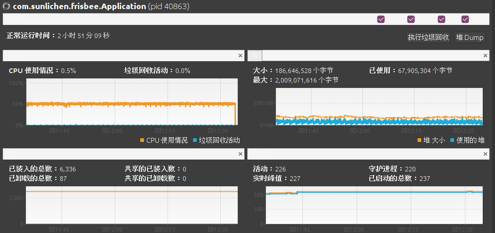

Frisbee Uid Generator
====================================

Frisbee Uid Generator 是JAVA语言实现的，基于[雪花算法(Snowflake)](https://github.com/twitter-archive/snowflake/blob/snowflake-2010/src/main/scala/com/twitter/service/snowflake/IdWorker.scala)
算法的唯一ID生成器，以WEB REST的方式对外提供服务（可结合实际需要进行改造），支持数据中心ID配置和工作节点ID配置，同时可对序号进行分片配置，
从而实现同数据中心ID和工作节点ID的情况下的集群部署，每个服务提供不同的分片数据。
基于NTP服务取得的本地时间戳和NTP服务器时间差值，从而使每次生成的时间戳都是基于真实NTP服务的时间，有效的避免的时间的回调或前调对UID生成的影响。
对外提供两个接口获取UID，1、实时的请求并根据当前时间戳等相关值计算UID并返回；2、预处理将UID放入ArrayBlockingQueue队列中缓存，请求UID时通过从队列中获取并返回。
单机Jmeter测试接口TPS:1.4万/秒，单元测试内部生成UID接口TPS：81万/秒（环境：联想T450 cpu:i5-5200 2.2GHz 内存8G，Ubuntu 20.04.1 LTS ）

依赖版本：[Java8](http://www.oracle.com/technetwork/java/javase/downloads/jdk8-downloads-2133151.html)及以上版本,


系统特点
--------------------
1. 基于NTP时间服务，有效避免因时间回拨导致的UID重复。<br/>
2. 通过workerId和DatacenterId实现的分布式部署（雪花算法）。<br/>
3. 同服务节点内（相同的workerId和DatacenterId）基于分片可实现集群部署，避免单点故障。<br/>
4. 基于ArrayBlockingQueue实现的内部队列，避免瞬时压力导致的服务响应过慢，提高服务可用性。<br/>
5. 无第三方依赖，减少依赖系统故障可能性。<br/>


雪花算法数据格式
--------------------
* 1位
  固定为0。二进制中最高位为1的都是负数，但是我们生成的id一般都使用整数，所以这个最高位固定是0 。
* 41位
  用来记录时间戳（毫秒）。41位可以表示2^41−1个毫秒的值，转化成单位年则是(2^41−1)/(1000*60*60*24*365)=69.73年，也就是从配置文件中设置的起始时间开始，最多可以使用69.73年。
* 5位
  数据中心ID，可配置最大正整数是2^5−1=31，可配置数据范围（0 到 31）。
* 5位
  工作节点ID，可配置最大正整数是2^5−1=31，可配置数据范围（0 到 31）。
* 12位
  序列号，用来记录同毫秒内产生的不同ID。最大正整数是2^12−1=4095，表示同一机器同一时间截（毫秒)内产生最多4095个ID序号。
  


飞盘算法（FrisbeeUid）实现
--------------------
* 41位
  时间戳，实现方式为当前本地时间 + NTP时间与本地时间差值 - 系统[配置文件](src/main/resources/application.properties)中起始时间，系统起始时间配置项为[frisbeeUid.startStamp]。
* 5位
  数据中心ID，取值范围（0 到 31），[配置文件](src/main/resources/application.properties)中配置项[frisbeeUid.datacenterId]。
* 5位
  工作节点ID，取值范围（0 到 31），[配置文件](src/main/resources/application.properties)中配置项[frisbeeUid.workerId]。
* 12位
  序号ID，1毫秒内最多可用4095个数值，也就是1秒内可生成409万个ID，对外提供服务时受限于各种因素，实际生成使用的ID无法达到此数值，
  所以考虑到ID使用效率不高的情况，将此ID进行分片 通过配置[frisbeeUid.sequenceModulo]和[frisbeeUid.sectionNode]将ID按模值进行分片，由不同的服务生成，使不同分片的服务构成集群从而提高吞吐量。


1bit|41bits|5bits|5bits|12bits
--|:--:|:--:|--:
固定值|当时时间戳+NTP时间差值-配置起始时间|数据中心ID|工作节点ID|序号


*** 数据中心ID和工作节点ID位数，可根据实际情况进行修改[代码文件](src/main/java/com/sunlichen/frisbee/enums/SnowFlakeBits.java)中位数长度，位数可调整给时间戳或工作节点ID ***

飞盘算法与雪花算法的比较
--------------------------------
* 相同点<br/>
  数据格式相同，长度相同。
* 差异点<br/>
	+ 41bits时间戳：雪花算法引入NTP时间差值进行修正，有效避免时间回调或前调。<br/>
	+ 12bits序号：加入分片规则，可实现同数据中心ID和同工作节点ID下的集群部署，多个分片服务组合为一个集群共同对外提供UID服务，有效避免单点故障。


调用接口
----------------------------------
* [http://ip:port/current_uid]
  获取实时生成的UID
* [http://ip:port/queue_uid]
  从队列中获取已生成的UID
* [http://ip:port/status]
  状态检查，返回json串数据，格式：[{"Date":"服务根据差值修正后的当前","StartStamp":"配置文件中配置的起始时间","datacenterId":"数据中心ID","workerId":"工作节点ID","SequenceModulo":"分片模值","SectionNode":"分片节点","TolerateTimeDiff":"最大容忍时间差异毫秒","count":"已取得UID数量（最大值2147483647，循环计数）","LastStamp":"最后获取UID时间","QueueSize":"当前队列长度"}]

压力测试结果
----------------------------------
+ 
+ 
+ 


Quick Start
===================
### 步骤1: 安装依赖
下载[Java8]以后版本(http://www.oracle.com/technetwork/java/javase/downloads/jdk8-downloads-2133151.html)和[Maven](https://maven.apache.org/download.cgi)


### 步骤2: 设置环境变量及依赖
* 设置JAVA_HOME和MAVEN_HOME
* 需要网络畅通，服务运行时会连接NTP时间同步服务器（目前配置的为：time2.aliyun.com,time1.aliyun.com,time3.aliyun.com ）

### 步骤3: 启动单元测试
```shell
mvn test
```

### 步骤4: 启动服务(仅测试使用)
```shell
mvn spring-boot:run
```

### 步骤5: 测试访问
* [http://localhost:8080/current_uid](http://localhost:8080/current_uid)
* [http://localhost:8080/queue_uid](http://localhost:8080/queue_uid)
* [http://localhost:8080/status](http://localhost:8080/status)


本人目前在找工作有工作机会可以推荐给我，感谢! toMail: sun.lc@foxmail.com


参考资料：
--------------------------
+ https://github.com/twitter-archive/snowflake/blob/snowflake-2010/src/main/scala/com/twitter/service/snowflake/IdWorker.scala
+ https://code.flickr.net/2010/02/08/ticket-servers-distributed-unique-primary-keys-on-the-cheap/
+ https://github.com/baidu/uid-generator
+ https://zhuanlan.zhihu.com/p/58690666
+ https://github.com/Meituan-Dianping/Leaf
+ https://www.dazhuanlan.com/2019/12/08/5dec94dd10ef2/

